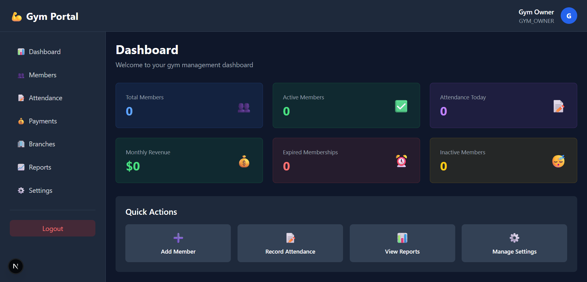
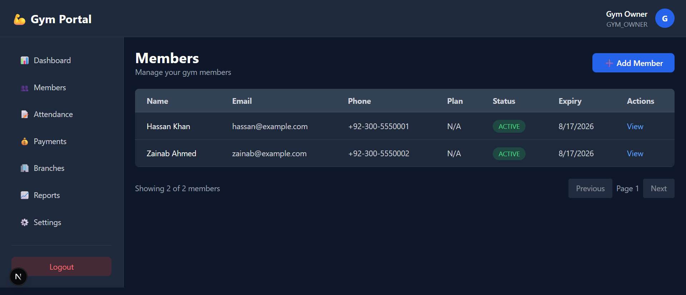
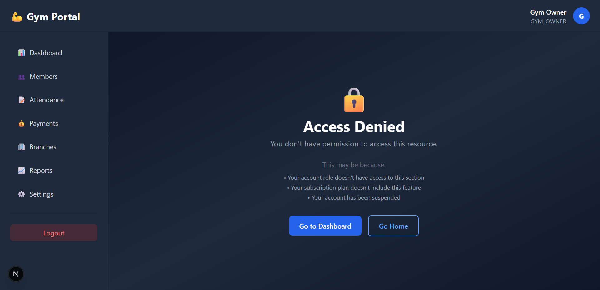

# Gym Portal - Multi-Tenant Gym Management SaaS

A production-ready, modern SaaS platform for managing multiple gyms with subscription tiers, member management, attendance tracking, and advanced analytics.

## Features

### Super Admin
- Create and manage multiple gyms
- Create gym owner accounts
- Assign subscription plans
- View all registered gyms
- Monitor total revenue
- Enable/disable premium features
- Manage subscriptions and feature flags

### Gym Owner
- Complete gym dashboard with analytics
- Manage gym profile and branches
- Member management (add/edit/delete)
- Attendance tracking (manual & biometric)
- Fee management and invoicing
- Staff and trainer management
- Advanced reports and analytics

### Features by Subscription Tier
- **Basic**: Manual attendance, single branch, basic reports
- **Premium**: Biometric integration, multi-branch, advanced reports, SMS notifications
- **Enterprise**: All features + custom support + custom integrations

## Tech Stack

- **Frontend**: Next.js 15 (App Router), React 19, TypeScript
- **Styling**: Tailwind CSS, Shadcn UI
- **State Management**: Zustand
- **Forms**: React Hook Form + Zod validation
- **Database**: PostgreSQL with Prisma ORM
- **Authentication**: NextAuth.js
- **File Upload**: Cloudinary
- **PDF Generation**: jsPDF + html2canvas
- **Charts**: Recharts
- **SMS/Email**: Twilio (optional)

## Prerequisites

- Node.js 18+ and npm/yarn
- PostgreSQL 12+
- Cloudinary account (for image uploads)
- NextAuth secret (generate with: `openssl rand -base64 32`)

## Installation

### 1. Clone and Setup

```bash
cd gym-portal
npm install
```

### 2. Configure Environment Variables

Copy `.env.example` to `.env.local` and fill in your values:

```bash
cp .env.example .env.local
```

**Required variables:**
- `DATABASE_URL`: PostgreSQL connection string
- `NEXTAUTH_URL`: Your app URL (http://localhost:3000 for development)
- `NEXTAUTH_SECRET`: Generate with `openssl rand -base64 32`

### 3. Setup Database

```bash
# Create database and run migrations
npm run db:push

# (Optional) Generate Prisma Client
npx prisma generate

# (Optional) Open Prisma Studio for visual database management
npm run db:studio
```

### 4. Seed Database (Optional)

```bash
npm run db:seed
```

This creates:
- Super admin account (email: admin@gym-portal.com, password: admin123)
- Sample gym
- Subscription plans (Basic, Premium, Enterprise)
- Sample members and data

### 5. Start Development Server

```bash
npm run dev
```

Open [http://localhost:3000](http://localhost:3000) in your browser.

## Project Structure

```
gym-portal/
├── src/
│   ├── app/                 # Next.js App Router
│   │   ├── api/            # API routes
│   │   ├── auth/           # Authentication pages
│   │   ├── dashboard/      # Dashboard pages
│   │   ├── layout.tsx      # Root layout
│   │   └── page.tsx        # Home page
│   ├── components/         # React components
│   │   ├── ui/            # Shadcn UI components
│   │   ├── forms/         # Form components
│   │   └── layout/        # Layout components
│   ├── lib/               # Utilities and helpers
│   │   ├── auth/          # Authentication helpers
│   │   ├── db/            # Database utilities
│   │   └── services/      # Business logic services
│   ├── hooks/             # Custom React hooks
│   ├── middleware/        # NextAuth middleware
│   ├── store/             # Zustand state stores
│   ├── types/             # TypeScript types
│   └── utils/             # Utility functions
├── prisma/
│   ├── schema.prisma      # Database schema
│   └── migrations/        # Database migrations
├── public/                 # Static assets
├── scripts/               # Helper scripts
├── .env.local            # Environment variables (local)
├── .env.example          # Environment variable template
├── next.config.js        # Next.js configuration
├── tailwind.config.js    # Tailwind CSS configuration
├── tsconfig.json         # TypeScript configuration
└── package.json          # Dependencies and scripts

```

## Database Schema

Key tables:
- **users**: All user accounts (Super Admin, Gym Owner, Staff)
- **gyms**: Gym information and status
- **subscriptions**: Subscription instances with plans
- **members**: Member information and membership details
- **attendance**: Check-in/check-out records
- **payments**: Fee and subscription payments
- **invoices**: Generated invoices
- **biometric_devices**: Connected biometric machines
- **notifications**: Email/SMS notifications

## API Routes

### Authentication
- `POST /api/auth/register` - Register gym owner
- `POST /api/auth/login` - Login
- `GET /api/auth/session` - Get current session

### Gym Management
- `GET /api/gyms` - List all gyms (Super Admin)
- `POST /api/gyms` - Create gym (Super Admin)
- `GET /api/gyms/[id]` - Get gym details
- `PUT /api/gyms/[id]` - Update gym (Owner)
- `DELETE /api/gyms/[id]` - Delete gym (Super Admin)

### Members
- `GET /api/members` - List members
- `POST /api/members` - Create member
- `GET /api/members/[id]` - Get member details
- `PUT /api/members/[id]` - Update member
- `DELETE /api/members/[id]` - Delete member

### Attendance
- `GET /api/attendance` - List attendance records
- `POST /api/attendance` - Record attendance
- `GET /api/attendance/[memberId]` - Get member attendance

### Payments & Fees
- `GET /api/payments` - List payments
- `POST /api/payments` - Record payment
- `GET /api/invoices` - List invoices
- `POST /api/invoices/generate` - Generate invoice PDF

### Analytics
- `GET /api/analytics/dashboard` - Dashboard metrics
- `GET /api/analytics/reports` - Generate reports

## Authentication Flow

1. User logs in with email/password
2. NextAuth verifies credentials against database
3. JWT token is issued
4. Middleware checks role and tenant access
5. User is redirected to appropriate dashboard

### Roles & Permissions

**Super Admin**
- Access to all gyms
- Can create/modify/delete gyms and plans
- Full system access

**Gym Owner**
- Access to own gym(s) only
- Can manage members, staff, branches
- Can view own analytics

**Staff Member**
- Limited access based on permissions
- Can record attendance
- Can view member information

## Multi-Tenancy

The app uses **database row-level multi-tenancy**:

1. Every record has a `gymId` that identifies the tenant
2. Middleware extracts `gymId` from session
3. All API queries are filtered by `gymId`
4. Staff members can only access their assigned gym

## Security

- Passwords are hashed with bcryptjs
- CSRF protection via NextAuth
- SQL injection prevention via Prisma
- CORS headers configured
- Rate limiting recommended for production
- All sensitive routes require authentication
- Role-based access control on all endpoints

## Development

### Database Migrations

```bash
# Create new migration
npx prisma migrate dev --name migration_name

# View migration history
npx prisma migrate status

# Reset database (careful!)
npm run db:reset
```

### Prisma Studio

```bash
npm run db:studio
```

Opens interactive database browser at http://localhost:5555

### Type Generation

```bash
npx prisma generate
```

## Deployment

### Vercel (Recommended)

```bash
# Push code to GitHub
git push origin main

# Create Verma project from GitHub
# Configure environment variables in Vercel dashboard
# Deploy automatically on push
```

### Environment Variables (Production)

- Set all variables in deployment platform
- Use strong `NEXTAUTH_SECRET` (generate locally)
- Use production PostgreSQL database
- Set `NEXTAUTH_URL` to production domain

### Database Migrations (Production)

```bash
# Safely run migrations in production
npm run db:migrate
```

## Testing Credentials

After running `npm run db:seed`:

**Super Admin**
- Email: `admin@gym-portal.com`
- Password: `admin123`

**Gym Owner**
- Email: `owner@gym-portal.com`
- Password: `owner123`

**Staff Member**
- Email: `staff@gym-portal.com`
- Password: `staff123`

## Common Issues

### Database Connection Error
- Check PostgreSQL is running
- Verify `DATABASE_URL` in `.env.local`
- Ensure database exists

### Prisma Client Not Found
```bash
npx prisma generate
npm run db:push
```

### NextAuth Session Not Working
- Verify `NEXTAUTH_SECRET` is set
- Check `NEXTAUTH_URL` matches your app URL
- Clear browser cookies

## Contributing

1. Create feature branch
2. Make changes
3. Test thoroughly
4. Submit pull request

## License

Proprietary - All rights reserved

## Support

For issues and questions, please create an issue in the repository or contact support.

## Roadmap

- [ ] Advanced biometric device integration (ZKTeco API)
- [ ] SMS/WhatsApp notifications (Twilio integration)
- [ ] Email notification service
- [ ] Advanced analytics dashboard
- [ ] Mobile app (React Native)
- [ ] API documentation (Swagger/OpenAPI)
- [ ] Unit and E2E tests
- [ ] Performance optimization
- [ ] Backup and recovery system
- [ ] Audit logging

---

**Version**: 1.0.0  
**Last Updated**: May 2026
## 📸 Dashboard Preview





